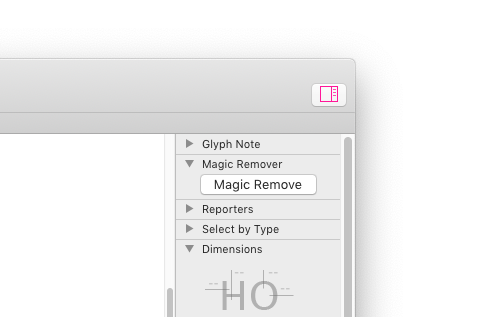

# Magic Remove

Palette plug-in for the Glyphs.app font editor, allows multiple-master deletion of nodes, anchors and components by a simple push of a button.

*After installation, Magic Remove will appear as button in the app palette on the right side (Cmd-Opt-P).*

### Usage

**Multiple-master deletion:** Select any number of nodes, anchors or components in Edit view and press *Magic Remove.* The selected nodes will be deleted on all compatible masters,

**Remove multiple nodes and keep shape:** The same behaviour you have when you select and delete an individual node, just for many nodes at once. Works for single master and multiple masters.

### Installation

1. Open *Window > Plugin Manager*
2. Find *Magic Remove* and click the *Install* button
3. Restart Glyphs.app

### License

Copyright 2018 Rainer Erich Scheichelbauer (@mekkablue).
Based on sample code by Georg Seifert (@schriftgestalt) and Jan Gerner (@yanone).

Licensed under the Apache License, Version 2.0 (the "License");
you may not use this file except in compliance with the License.
You may obtain a copy of the License at

http://www.apache.org/licenses/LICENSE-2.0

See the License file included in this repository for further details.
